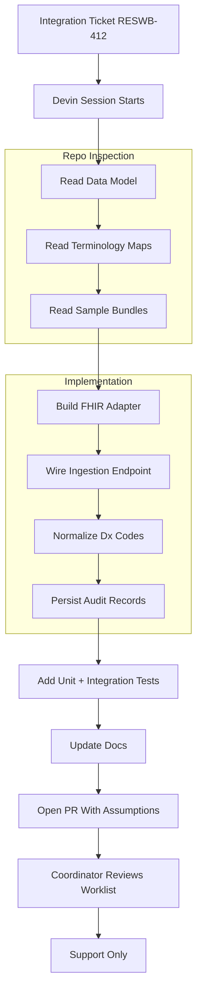
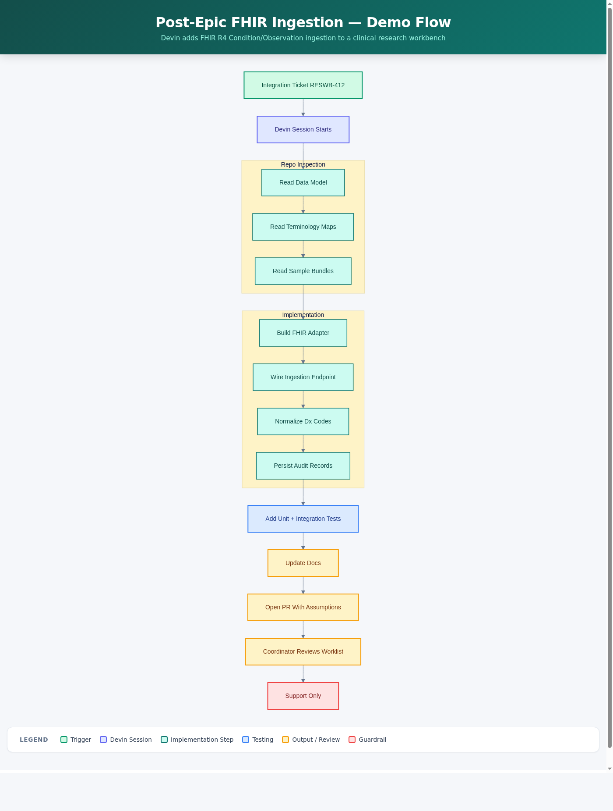

# Post-Epic Clinical Research FHIR Ingestion Demo

Devin adds FHIR R4 `Condition`/`Observation` ingestion to a clinical research
workbench, closing the manual-entry gap for trial pre-screening support.



<details><summary>PNG fallback</summary>



</details>

[Interactive HTML flowchart &rarr;](docs/flowchart.html)

## What this demo shows

A healthcare enterprise engineering team hands Devin a realistic Jira-style
ticket: add FHIR R4 ingestion (Condition + Observation resources) into an
internal clinical research workbench used for trial pre-screening support. Devin
inspects the existing backend/frontend/data model, implements the adapter,
normalizes cancer-diagnosis codes where mappings exist, persists an audit record,
adds tests, updates docs, and opens a PR — all governed, reviewable enterprise
software work that accelerates integration without increasing clinical risk.

> **Guardrail:** the workbench surfaces candidate matches for human review. It
> never makes eligibility, enrollment, or treatment decisions. No PHI — all data
> is synthetic.

## What Devin does live

Devin receives the ticket (`docs/TICKET.md`), inspects the repo (data model,
terminology mappings, sample FHIR bundles), implements the
`app/adapters/fhir/adapter.py` adapter and wires `POST /api/ingest/fhir`,
handles unmapped codes (prostate cancer → skip + audit), adds
`tests/test_fhir_ingestion.py`, updates documentation, and opens a PR with
assumptions and reviewer notes. The audience sees the workbench UI before (empty
worklist) and after (matches light up) via Devin's live browser tab, plus the
Swagger UI at `/docs` and the generated PR.

## Ingesting FHIR data

`POST /api/ingest/fhir` accepts a FHIR R4 `Bundle` of `Condition` and
`Observation` resources and returns a summary of what happened:

```bash
python -m app.seed          # participants + trials (no clinical data yet)
uvicorn app.main:app        # serve the workbench

curl -s -X POST localhost:8000/api/ingest/fhir \
  -H 'content-type: application/json' \
  --data @sample_data/fhir/condition_bundle.json
curl -s -X POST localhost:8000/api/ingest/fhir \
  -H 'content-type: application/json' \
  --data @sample_data/fhir/observation_bundle.json
```

Response (and the `IngestionAudit` row written per request):

```json
{
  "source": "api",
  "resource_type": "Condition",
  "resources_received": 6,
  "resources_ingested": 5,
  "resources_skipped": 1,
  "outcome": "partial",
  "detail": "Received 6, ingested 5, skipped 1. Skips: Condition for MRN-1005: unmapped code(s) http://snomed.info/sct|399068003",
  "audit_id": 1
}
```

How the adapter (`app/adapters/fhir/adapter.py`) normalizes each entry:

- **Subject resolution** — `subject.reference` (`Patient/{mrn}`) is matched to an
  existing participant. Resources for unknown MRNs are skipped (never created).
- **Normalization** — `Condition.code.coding[]` → `map_diagnosis` →
  `Diagnosis.category`; `Observation.code.coding[]` → `map_measure` →
  `MeasureResult.measure`. The original `system`/`code`/`display` is preserved.
- **Values** — Observation values are read from `valueQuantity.value` or
  `valueInteger` (ECOG is an integer, ANC a quantity).
- **Unmapped codes** — skipped (not failed), counted, and recorded as
  `system|code` in the audit `detail`. One unknown code never fails the bundle.
- **Audit** — exactly one `IngestionAudit` row per request; read the history at
  `GET /api/ingest/audit`.

> **Guardrail:** ingestion only normalizes and stores synthetic data. The
> pre-screening worklist remains a human-reviewed support tool — no eligibility,
> enrollment, or treatment decisions.

## How the demo runs

1. Presenter opens a Devin session against this repo.
2. Pastes the ticket prompt (text of `docs/TICKET.md`) into the session.
3. Devin reads the codebase, implements the adapter, runs `ruff check .` and
   `pytest`, and opens a PR.
4. Devin runs `python -m app.seed && uvicorn app.main:app` inside the session,
   then POSTs the sample bundles to the ingest endpoint to populate the
   workbench.
5. Audience sees the workbench worklist update in Devin's browser tab: Alex
   Rivera and Casey Kim surface as potential matches for LUNG-2024-017.

### Local development

```bash
pip install -e ".[dev]"
python -m app.seed
uvicorn app.main:app --reload     # http://localhost:8000  workbench UI
                                   # http://localhost:8000/docs  Swagger
ruff check .
pytest
```

## Repo layout

```
app/
  main.py                  FastAPI entrypoint
  database.py              SQLAlchemy + SQLite
  models.py                ORM (Participant, Diagnosis, MeasureResult, Trial, …)
  schemas.py               Pydantic I/O models
  seed.py                  Seed synthetic participants + trials
  services/prescreen.py    Pre-screening match logic (existing)
  routers/
    participants.py        GET participant endpoints
    trials.py              GET trials + pre-screening worklist
    ingestion.py           POST /api/ingest/fhir + GET /api/ingest/audit
  adapters/fhir/adapter.py FHIR R4 Bundle parsing + normalization
  terminology/mappings.py  Partial SNOMED/ICD-10/LOINC → internal key maps
static/                    Workbench UI (HTML/CSS/JS)
sample_data/fhir/          Synthetic FHIR R4 Condition + Observation bundles
tests/                     Existing pre-screening + API tests
docs/                      Ticket, data model, implementation plan, flowchart
```

## Key concepts

| Term | Meaning |
|---|---|
| FHIR R4 | HL7 Fast Healthcare Interoperability Resources, Release 4 |
| Condition | FHIR resource representing a diagnosis (cancer type, coded in SNOMED CT / ICD-10) |
| Observation | FHIR resource representing a measurement (ECOG score, ANC lab value, coded in LOINC) |
| Pre-screening | Matching participants against trial criteria *for human review* — not an eligibility or enrollment decision |
| Terminology map | Lookup from external codes (SNOMED/ICD-10/LOINC) to internal workbench keys |
| Ingestion audit | One row per ingest call recording what was received, ingested, and skipped |
| Unmapped code | A clinical code with no entry in the terminology map (expected behavior: skip + audit) |
| MRN | Medical Record Number — synthetic identifier linking FHIR subjects to participants |
| ECOG | Eastern Cooperative Oncology Group performance status (LOINC 89247-1), 0–5 scale |
| ANC | Absolute Neutrophil Count (LOINC 751-8), x10⁹/L |
